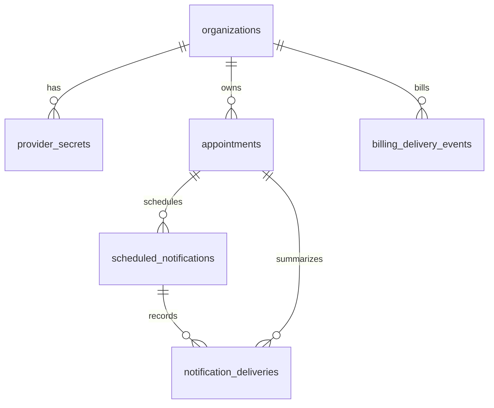

# Dashboard Database Guide

This module stores appointments, planned reminders, and delivery results in PostgreSQL. A future dashboard can read from these tables to show upcoming appointments, past appointments, upcoming notifications, and sent or failed notifications.

## Main Tables

### `organizations`

Represents an OpenMRS organization or hospital tenant.

Important columns:

- `Id`: internal organization ID.
- `Key`: stable organization key used by the API, for example `default` or `demo-hospital`.
- `Name`: display name.
- `TimeZone`: organization timezone.
- `IsEnabled`: whether this organization is active.

Use this table as the starting point for tenant filtering in dashboard queries.

### `provider_secrets`

Stores encrypted provider credentials per organization.

Important columns:

- `OrganizationId`: links to `organizations`.
- `Provider`: provider name, for example `SwiftSend`, `SecurePost`, `LegacyLink`, or `AsyncFlow`.
- `EncryptedPayload`: encrypted credential JSON.
- `Nonce`: AES-GCM nonce.

The dashboard should normally not display this table, except maybe showing which providers are configured for an organization. Never expose `EncryptedPayload` or `Nonce` in a UI.

### `appointments`

Stores appointment data received through the appointment intake endpoint.

Important columns:

- `Id`: internal appointment ID.
- `OrganizationId`: links to `organizations`.
- `AppointmentUuid`: OpenMRS appointment UUID.
- `PatientUuid`, `PatientName`, `PatientPhone`, `PatientEmail`: patient/contact fields needed for sending.
- `StartDateTime`: appointment start time in UTC.
- `Status`: appointment status, for example `Confirmed` or `Cancelled`.
- `Location`: appointment location.
- `Instructions`: patient instructions.
- `RawSourcePayload`: original source payload JSON for debugging/audit.
- `PiiPurgedAt`: when patient/contact PII columns were cleared by the retention worker (null = not yet purged).

Appointments are unique per organization using `(OrganizationId, AppointmentUuid)`.

After **14 days** without recent activity (`UpdatedAt` or a successful delivery `SentAt`), the producer `DataRetentionWorker` nulls `PatientName`, `PatientPhone`, `PatientEmail`, `Location`, `Instructions`, and `RawSourcePayload`. Correlation IDs (`AppointmentUuid`, `PatientUuid`, `StartDateTime`, `Status`) remain.

### `scheduled_notifications`

Stores planned reminder moments for appointments.

Important columns:

- `Id`: internal scheduled notification ID.
- `OrganizationId`: links to `organizations`.
- `AppointmentId`: links to `appointments`.
- `ReminderType`: reminder type, currently `24h` or `1h`.
- `ScheduledSendAt`: when the scheduler should publish the notification.
- `Status`: notification lifecycle status.

Current statuses:

- `Pending`: waiting until `ScheduledSendAt`.
- `Publishing`: claimed by the scheduler for outbound publish (short-lived).
- `Queued`: published to RabbitMQ, waiting for provider processing.
- `Sent`: all provider deliveries succeeded.
- `Failed`: one or more provider deliveries failed.
- `Cancelled`: appointment was cancelled or changed before sending.

### `notification_deliveries`

Stores the delivery result per provider for each scheduled notification.

Important columns:

- `Id`: internal delivery ID.
- `OrganizationId`: links to `organizations`.
- `AppointmentId`: links to `appointments`.
- `ScheduledNotificationId`: links to `scheduled_notifications`.
- `Provider`: provider name.
- `Status`: `Sent` or `Failed`.
- `SentAt`: timestamp for successful delivery.
- `FailedAt`: timestamp for failed delivery.
- `ErrorMessage`: failure reason if available.

Each scheduled notification can have multiple delivery rows, one per provider.

### `billing_delivery_events`

PII-free billing and audit ledger. One row per delivery attempt (success or failure). No patient name, phone, email, or appointment UUID; no foreign key to `appointments`.

Important columns:

- `Id`: event ID.
- `OrganizationId`: links to `organizations` (use `organizations.Key` in reports).
- `Provider`: messaging provider name.
- `ReminderType`: `24h` or `1h`.
- `Status`: `Sent` or `Failed`.
- `OccurredAt`: when the attempt was recorded (maps to sent time when `Status` is `Sent`, failed time when `Failed`).
- `CorrelationId`: opaque GUID for invoice disputes (not a patient or appointment identifier).
- `ProviderMessageId`: external provider reference when delivery succeeded (nullable, max 128 characters).

Rows older than **365 days** are deleted by `DataRetentionWorker` (`DataRetention:BillingRetentionDays` in producer config). Operational PII purge does not remove billing events younger than 365 days.

Example billing query (no PII):

```sql
select
  o."Key" as organization_key,
  b."Provider",
  b."ReminderType",
  b."Status",
  b."OccurredAt",
  b."CorrelationId",
  b."ProviderMessageId"
from billing_delivery_events b
join organizations o on o."Id" = b."OrganizationId"
where o."Key" = 'default'
  and b."OccurredAt" >= now() - interval '30 days'
order by b."OccurredAt" desc;
```

### Billing deliveries report API

Administrators can export PII-free billing rows over HTTP instead of querying SQL directly.

**Endpoint:** `GET /api/reports/deliveries`

**Query parameters:**

| Parameter | Required | Description |
|-----------|----------|-------------|
| `organizationKey` | Yes | Organization key (e.g. `default`) |
| `from` | Yes | Start of range (ISO-8601, inclusive) |
| `to` | Yes | End of range (ISO-8601, inclusive) |

**Authentication:** Same as appointment intake — header `X-Api-Key` (required). Optional header `X-Organization-Key` when not passing `organizationKey` in the query (falls back to configured default org).

**Example:**

```bash
curl "http://localhost:5001/api/reports/deliveries?organizationKey=default&from=2026-05-01T00:00:00Z&to=2026-05-31T23:59:59Z" \
  -H "X-Api-Key: change-me-in-prod"
```

**Response:** JSON array of objects. Each object contains only these fields (no patient name, phone, email, or appointment UUID):

| Field | Source |
|-------|--------|
| `organizationKey` | `organizations.Key` |
| `provider` | `Provider` |
| `reminderType` | `ReminderType` |
| `status` | `Sent` or `Failed` |
| `sentAt` | `OccurredAt` when `status` is `Sent`, otherwise `null` |
| `failedAt` | `OccurredAt` when `status` is `Failed`, otherwise `null` |
| `providerMessageId` | External provider reference (nullable) |
| `correlationId` | Opaque GUID for invoice disputes |

Data is read from `billing_delivery_events` only — not from `appointments` or `notification_deliveries`.

## Relationship Overview



## Dashboard Views

### Upcoming Appointments

Appointments with a start time in the future.

```sql
select
  o."Key" as organization,
  a."AppointmentUuid",
  a."PatientUuid",
  a."StartDateTime",
  a."Status",
  a."Location"
from appointments a
join organizations o on o."Id" = a."OrganizationId"
where a."StartDateTime" > now()
order by a."StartDateTime";
```

### Past Appointments

Appointments that have already started.

```sql
select
  o."Key" as organization,
  a."AppointmentUuid",
  a."PatientUuid",
  a."StartDateTime",
  a."Status"
from appointments a
join organizations o on o."Id" = a."OrganizationId"
where a."StartDateTime" <= now()
order by a."StartDateTime" desc;
```

### Upcoming Notifications

Pending reminders that have not been sent yet.

```sql
select
  o."Key" as organization,
  a."AppointmentUuid",
  a."PatientUuid",
  sn."ReminderType",
  sn."ScheduledSendAt",
  sn."Status"
from scheduled_notifications sn
join appointments a on a."Id" = sn."AppointmentId"
join organizations o on o."Id" = sn."OrganizationId"
where sn."Status" = 'Pending'
order by sn."ScheduledSendAt";
```

### Sent And Failed Notifications

Provider-level delivery history.

```sql
select
  o."Key" as organization,
  a."AppointmentUuid",
  sn."ReminderType",
  d."Provider",
  d."Status",
  d."SentAt",
  d."FailedAt",
  d."ErrorMessage"
from notification_deliveries d
join scheduled_notifications sn on sn."Id" = d."ScheduledNotificationId"
join appointments a on a."Id" = d."AppointmentId"
join organizations o on o."Id" = d."OrganizationId"
order by d."UpdatedAt" desc;
```

### Recent Delivery Failures (last 1h)

Operational error oversight for administrators. Used by the provisioned Grafana panel **Recent Delivery Failures (last 1h)**.

```sql
select
  d."FailedAt" as failed_at,
  o."Key" as organization,
  a."AppointmentUuid" as appointment_uuid,
  d."Provider" as provider,
  left(d."ErrorMessage", 500) as error_message
from notification_deliveries d
join scheduled_notifications sn on sn."Id" = d."ScheduledNotificationId"
join appointments a on a."Id" = d."AppointmentId"
join organizations o on o."Id" = d."OrganizationId"
where d."Status" = 'Failed'
  and d."FailedAt" >= now() - interval '1 hour'
order by d."FailedAt" desc
limit 50;
```

## Suggested Dashboard Filters

- Organization: filter by `organizations.Key`.
- Appointment period: filter `appointments.StartDateTime`.
- Notification status: filter `scheduled_notifications.Status`.
- Provider status: filter `notification_deliveries.Provider` and `notification_deliveries.Status`.

## Privacy Notes

The `appointments` table stores patient-identifiable fields (`PatientName`, `PatientPhone`, `PatientEmail`) for outbound messaging. Default admin dashboard SQL in this repo and the provisioned Grafana **Notification Module** dashboard use **`PatientUuid`** and **`AppointmentUuid` only**—not names or contact fields.

Restrict dashboard access per organization. For **billing and invoice reconciliation**, use `billing_delivery_events` (no patient fields). Use `notification_deliveries` only for operational troubleshooting where appointment context is required, and restrict roles that can join to `appointments` for name, phone, email, instructions, or `RawSourcePayload`.
