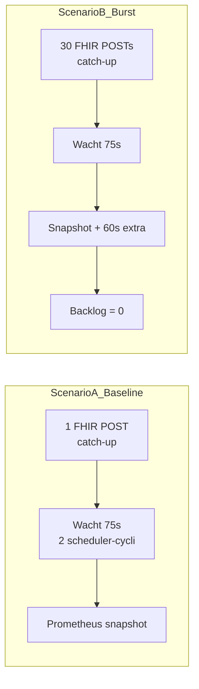

# Performancerapportage

**Doel:** aantonen dat schaalbaarheid en robuustheid meetbaar zijn via Prometheus-metrics en realtime Grafana-monitoring — als aanvulling op de [FMEA](fmea/FMEA.md) (rubric criterium 2, niveau *Voldoende*).

**Datum metingen:** 2026-05-25  
**Omgeving:** Docker Compose (`env.example`), single-node lokaal (Windows)

---

## 1. Scope en beperkingen

Deze rapportage is **geen productie-loadtest** op cluster-schaal. We meten:

- of de volledige keten (FHIR-intake → scheduler → RabbitMQ → consumer → provider) throughput en latency exposeert;
- hoe de scheduler omgaat met een **lichte burst** van catch-up reminders;
- of backlog-alerts en FMEA-maatregelen zichtbaar zijn in monitoring.

**Niet getest:** horizontale schaal (meerdere producer/consumer replicas), chaos-scenario's (TEST_CHECKLIST N1–N7), TLS/productie-infra.

---

## 2. Meetopstelling

| Onderdeel | Details |
|-----------|---------|
| Stack | Producer, Consumer, RabbitMQ, PostgreSQL, FakeComWorld, OTel Collector → Prometheus, Grafana |
| Start | `docker compose --env-file env.example up --build -d` |
| Scheduler | Poll-interval 30 s, batch size 25 (`SCHEDULER_POLL_INTERVAL_SECONDS`, `SCHEDULER_BATCH_SIZE` in [`env.example`](../env.example)) |
| Metrics | OpenTelemetry → Prometheus ([`NotificationTelemetry.cs`](../src/NotificationModule.Shared/Observability/NotificationTelemetry.cs)) |
| Dashboard | Grafana → **Notification Module - Prometheus Metrics** ([`notification-module-prometheus-dashboard.json`](../observability/grafana/dashboards/notification-module-prometheus-dashboard.json)) |
| Alertdrempels | [`notification_rules.yml`](../observability/prometheus/rules/notification_rules.yml) |

### Catch-up scheduling (testversneller)

Voor performance-tests gebruiken we afspraken met `start = now + 30 minuten`. De 1h-reminder valt dan in het verleden en wordt direct ingepland (`scheduledSendAt = now`):

```csharp
// AppointmentIngestionService.cs
var isCatchUp = idealSendAt <= now;
var scheduledSendAt = isCatchUp ? now : idealSendAt;
```

Zo wachten we niet 24 uur op een echte reminder.

### Opmerking over end-to-end latency

`notification_end_to_end_latency_seconds` meet tijd vanaf `Appointment.CreatedAt` tot delivery. Voor geplande reminders kan dat uren zijn. Voor **pipeline-performance** gebruiken we daarom `notification_dispatch_duration_ms` (provider HTTP) en `notification_pending_oldest_seconds` (scheduler-backlog).

---

## 3. Testscenario's



### Scenario A — Baseline (happy path)

1. Schone stack (`docker compose down -v` optioneel bij eerste run).
2. Eén OpenMRS webhook POST naar `/api/webhooks/openmrs/appointments/default` (catch-up, `start = UTC now + 30 min`).
3. Wacht **75 seconden** (~2 scheduler-cycli).
4. Prometheus instant queries (5 min venster).

### Scenario B — Lichte intake-burst

1. **30** FHIR POSTs (zelfde catch-up `start`, unieke `identifier.value`).
2. Wacht **75 seconden**, snapshot metrics (10 min venster).
3. Wacht **nog 60 seconden**, eindsnapshot backlog.

**Reproduceerbaar (PowerShell):**

```powershell
docker compose --env-file env.example up --build -d
# Wacht tot http://127.0.0.1:5001/ready = 200

$start = (Get-Date).ToUniversalTime().AddMinutes(30).ToString("yyyy-MM-ddTHH:mm:ssZ")
$body = '{"resourceType":"Appointment","status":"booked","start":"' + $start + '", ... }'
# Scenario A: 1x POST; Scenario B: 30x POST in loop
# Query: http://127.0.0.1:9090/api/v1/query?query=<PromQL>
```

---

## 4. Resultaten

### Scenario A — Baseline (75 s na 1 POST)

| Metric | PromQL | Waarde | Interpretatie |
|--------|--------|--------|---------------|
| Pending count | `notification_pending_count_notifications` | 2 | Reminder(s) wachten op scheduler-batch |
| Oudste pending (s) | `notification_pending_oldest_seconds` | 20,9 | Ruim onder alert-drempel 300 s |
| Delivery success (5m) | `increase(notification_delivery_success_deliveries_total[5m])` | 0 | Nog geen dispatch binnen eerste 75 s (batch nog niet vol) |
| Scheduler cycle p95 (ms) | `histogram_quantile(0.95, sum by (le) (rate(scheduler_cycle_duration_ms_milliseconds_bucket[5m])))` | — | Te weinig samples in korte venster |
| Delivery failures (5m) | `increase(notification_delivery_failure_deliveries_total[5m])` | 0 | Geen fouten |
| DLQ (5m) | `increase(notification_messages_dlq_total[5m])` | 0 | Geen DLQ-buildup |

### Scenario B — Burst 30 POSTs

**Direct na 75 s:**

| Metric | PromQL | Waarde | Interpretatie |
|--------|--------|--------|---------------|
| Appointments ingested (10m) | `increase(appointments_ingested_total[10m])` | 34,5 | 30 burst + eerdere test-POSTs in venster |
| Dispatches (10m) | `increase(notification_dispatch_dispatches_total[10m])` | 13,0 | Eerste scheduler-batch (max 25/cyclus) deels verwerkt |
| Delivery success (10m) | `increase(notification_delivery_success_deliveries_total[10m])` | 13,0 | 1:1 met dispatches — geen stille failures |
| Pending count | `notification_pending_count_notifications` | 30 | Backlog aanwezig na eerste batch |
| Oudste pending (s) | `notification_pending_oldest_seconds` | 5,4 | Gezond; geen stall |
| Dispatch p95 (ms) | `histogram_quantile(0.95, … notification_dispatch_duration_ms … [10m])` | 6125 | Provider HTTP (incl. retries); ruim onder 30 s E2E-alert |
| Scheduler cycle p95 (ms) | `histogram_quantile(0.95, … scheduler_cycle_duration_ms … [10m])` | 82,8 | Scheduler zelf is licht (< 100 ms p95) |
| Dispatch rate (5m) | `rate(notification_dispatch_dispatches_total[5m])` | 0,04/s | ~2,4 dispatches/min under load |
| Delivery failures (10m) | `increase(notification_delivery_failure_deliveries_total[10m])` | 0 | Geen provider-fouten |
| DLQ (10m) | `increase(notification_messages_dlq_total[10m])` | 0 | Geen poison messages |

**Na +60 s extra (totaal ~135 s na burst):**

| Metric | Waarde | Interpretatie |
|--------|--------|---------------|
| Pending count | **0** | Backlog volledig weggewerkt |
| Oudste pending (s) | **0** | Geen achterstand |
| Delivery success (15m) | 26,4 | ~31 reminders verwerkt (burst + baseline) |

**Conclusie scenario B:** batch size 25 + poll 30 s verwerkt ~30 catch-up reminders binnen **2–3 scheduler-cycli** (~2 min). Geen alert `HighPendingQueueAge` (> 300 s) of `SchedulerStalledWithBacklog`.

---

## 5. Koppeling FMEA ↔ monitoring

| FMEA failure mode | Component | Metric / alert | Bewijs in deze run |
|-------------------|-----------|----------------|-------------------|
| Scheduler publiceert te laat | Producer | `notification_pending_oldest_seconds`, alert `HighPendingQueueAge` | Max 20,9 s (A), 5,4 s (B) — ver onder 300 s |
| Scheduler stil met backlog | Producer | alert `SchedulerStalledWithBacklog` | Pending daalde naar 0; geen stall |
| RabbitMQ publish mislukt | Producer / RabbitMQ | `scheduler_cycle_duration_ms`, status `Pending` retry | Scheduler p95 ~83 ms; deliveries stijgen |
| Provider HTTP traag/fout | Consumer | `notification_dispatch_duration_ms` p95, `notification_delivery_failure_total` | p95 ~6,1 s; failures = 0 |
| Dubbele verwerking | Producer | `FOR UPDATE SKIP LOCKED` | Geen abnormale dispatch-spikes; delivery ≈ dispatch |
| DLQ-opbouw | Consumer | `notification_messages_dlq_total` | 0 in beide scenario's |
| PII te lang bewaard | PostgreSQL | `DataRetentionWorker` | Geïmplementeerd — zie [FMEA](fmea/FMEA.md) |

Dieper failure-analyse: [fmea/FMEA.md](fmea/FMEA.md). Retry/fallback-paden: [RELIABILITY.md](RELIABILITY.md).

---

## 6. Realtime monitoring (presentatie-checklist)

1. Start stack: `docker compose --env-file env.example up --build -d`
2. Open Grafana: [http://localhost:3000](http://localhost:3000) (default `admin` / `admin` uit `env.example`)
3. Dashboard: **Notification Module - Prometheus Metrics**
4. Toon tijdens Scenario B:
   - **Pending Notifications Count** / **Oldest Pending Notification**
   - **Dispatch Duration p95**
   - **Delivery Success Rate (by provider)**
5. Prometheus alerts: [http://localhost:9090/alerts](http://localhost:9090/alerts) — geen firing rules onder normale load

---

## 7. Conclusie

De communicatiemodule exposeert voldoende metrics om throughput, scheduler-gezondheid en provider-latency te volgen. Onder baseline + burst van **30 catch-up reminders** op een single-node Docker-stack:

- verwerkt de scheduler de backlog binnen **~2 minuten** (pending → 0);
- blijven **pending-oldest** en **scheduler cycle p95** ruim binnen alert-drempels;
- zijn **delivery failures** en **DLQ** nul;
- sluiten metingen aan bij de FMEA-maatregelen (batch polling, `SKIP LOCKED`, publish-retry, provider fallback).

Voor productie-schaal zijn aanvullende stappen nodig (horizontale replicas, load tests, TLS-terminatie) — buiten scope van dit rapport.

---

## Gerelateerde documenten

- [FMEA](fmea/FMEA.md) — failure modes per component
- [RELIABILITY.md](RELIABILITY.md) — retries, DLQ, fallback
- [TESTRAPPORT.md](TESTRAPPORT.md) — unit/systeemtests
- [README.md](../README.md) — opstarten en observability-URLs
