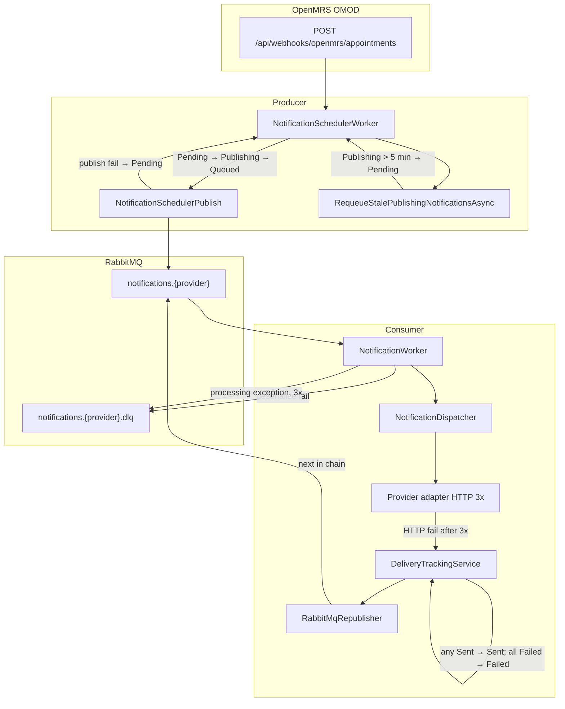

# Betrouwbaarheid en retries

Dit document beschrijft hoe de notificatiemodule omgaat met fouten en tijdelijke storingen. Betrouwbaarheid is opgebouwd in lagen:

1. **OpenMRS OMOD** — outbox + retry bij webhook POST naar Producer
2. **Scheduler (producer)** — polling, publish-retry, herstel van vastgelopen `Publishing`-rijen
3. **RabbitMQ** — message-retry en dead-letter queues (DLQ)
4. **Provider HTTP** — maximaal 3 pogingen per adapter
5. **Fallback-republish** — volgende provider in de organisatieketen
6. **Delivery tracking** — eindstatus `Sent` of `Failed` op basis van alle pogingen

## Statuslevenscyclus `scheduled_notifications`

| Status | Betekenis |
|--------|-----------|
| `Pending` | Wacht op verzending (inclusief publish-retries, ontbrekende secrets, stale recovery) |
| `Publishing` | Geclaimd door scheduler; RabbitMQ-publish loopt |
| `Queued` | Succesvol gepubliceerd naar RabbitMQ |
| `Sent` | Minstens één provider heeft succesvol geleverd |
| `Failed` | Alle providers in de keten hebben gefaald |
| `Cancelled` | Afspraak geannuleerd of bijgewerkt — zie [`OMOD_BRIDGE.md`](openmrs/OMOD_BRIDGE.md) |

Implementatie: [`ScheduledNotificationStatuses`](../src/NotificationModule.Shared/Persistence/ScheduledNotificationStatuses.cs)

---

## Scheduler-retry (producer)

De scheduler draait als background service in de producer en publiceert due notificaties naar RabbitMQ.

**Implementatie:** [`NotificationSchedulerWorker.cs`](../src/NotificationModule.Producer/Services/NotificationSchedulerWorker.cs), [`NotificationSchedulerPublish.cs`](../src/NotificationModule.Producer/Services/NotificationSchedulerPublish.cs)

| Instelling | Configuratie | Standaard |
|------------|--------------|-----------|
| Poll-interval | `Scheduler:PollIntervalSeconds` (minimum 5) | 30 seconden |
| Batchgrootte | `Scheduler:BatchSize` (1–100) | 25 |

Zie [`appsettings.json`](../src/NotificationModule.Producer/appsettings.json).

### Claim- en publish-flow

1. Elke cyclus: atomisch `Pending → Publishing` via PostgreSQL `FOR UPDATE SKIP LOCKED` (alleen rijen waar `ScheduledSendAt <= now`).
2. Per rij: bericht opbouwen en publiceren via [`RabbitMqPublisher`](../src/NotificationModule.Producer/Services/RabbitMqPublisher.cs).
3. **Succes:** `Publishing → Queued`.
4. **Mislukt (exception bij publish):** terug naar **`Pending`** — opnieuw geprobeerd bij de volgende poll (geen maximum aantal pogingen).
5. **Ontbrekende provider-secrets:** blijft **`Pending`**, warning gelogd — zie [`NotificationSchedulerPublish.ProcessClaimedBatchAsync`](../src/NotificationModule.Producer/Services/NotificationSchedulerPublish.cs).

### RabbitMQ-verbinding

[`RabbitMqPublisher.EnsureConnectedWithRetry`](../src/NotificationModule.Producer/Services/RabbitMqPublisher.cs) probeert elke **3 seconden** opnieuw te verbinden zolang RabbitMQ niet bereikbaar is (blocking retry bij opstarten en publish).

---

## Verouderde `Publishing`-status

Als de producer crasht tussen claim (`Publishing`) en succesvolle publish, blijven rijen hangen. Dit herstelt zich automatisch.

**Implementatie:** [`RequeueStalePublishingNotificationsAsync`](../src/NotificationModule.Producer/Services/NotificationSchedulerWorker.cs)

| Parameter | Waarde |
|-----------|--------|
| Drempel | **`StalePublishingThreshold = 5 minuten`** |
| Wanneer | Start van **elke** scheduler-cyclus, vóór nieuwe claims |
| Actie | `Status = Publishing` én `UpdatedAt` ouder dan drempel → reset naar **`Pending`** |

---

## Provider HTTP-retry (3 pogingen)

Elke messaging-adapter probeert HTTP-calls maximaal **3 keer** voordat een mislukking wordt teruggegeven.

| Provider | Bestand | Backoff |
|----------|---------|---------|
| SwiftSend | [`SwiftSendProvider.cs`](../src/NotificationModule.Consumer/Adapters/SwiftSendProvider.cs) | 500 ms × poging |
| SecurePost | [`SecurePostProvider.cs`](../src/NotificationModule.Consumer/Adapters/SecurePostProvider.cs) | 500 ms × poging |
| LegacyLink | [`LegacyLinkProvider.cs`](../src/NotificationModule.Consumer/Adapters/LegacyLinkProvider.cs) (`PostXmlWithRetryAsync`) | 500 ms × poging |
| AsyncFlow | [`AsyncFlowProvider.cs`](../src/NotificationModule.Consumer/Adapters/AsyncFlowProvider.cs) | POST: 500 ms × poging; GET-poll: 300 ms × poging |

### Wanneer opnieuw proberen

- HTTP **5xx**, **408**, **429**
- `HttpRequestException` (transient netwerkfout)

### Wanneer niet opnieuw proberen

- Overige **4xx** — permanente afwijzing door de provider

### Na 3 mislukte pogingen

De adapter retourneert het laatste antwoord. [`NotificationDispatcher`](../src/NotificationModule.Consumer/Services/NotificationDispatcher.cs) geeft `Success = false` terug (**geen exception**) → delivery wordt als **Failed** geregistreerd → fallback-pad (hieronder).

**Telemetrie:** `ProviderRetryAttempts`, `ProviderRetryAttemptCount`.

**Belangrijk:** provider-HTTP-fouten tellen **niet** mee voor RabbitMQ `x-retry-count` en gaan **niet** naar de DLQ.

---

## Provider fallback-republish

Als de preferred provider faalt na HTTP-retries, publiceert de consumer het bericht opnieuw naar de volgende provider in de organisatieketen.

**Implementatie:**

- [`NotificationWorker.TryRepublishToFallbackAsync`](../src/NotificationModule.Consumer/Workers/NotificationWorker.cs)
- [`RabbitMqRepublisher.Republish`](../src/NotificationModule.Consumer/Services/RabbitMqRepublisher.cs)
- [`DeliveryTrackingService.UpdateScheduledNotificationStatusAsync`](../src/NotificationModule.Consumer/Services/DeliveryTrackingService.cs)

### Keten

1. **`PreferredProvider`** (eerste keuze)
2. **`FallbackProviders`** (comma-gescheiden lijst)

Configureer via `PUT /api/organizations/{organizationKey}/providers` — zie [`DASHBOARD_DATABASE.md`](DASHBOARD_DATABASE.md).

### Gedrag

- Trigger: dispatch retourneert `Success = false`.
- Pogingen worden bijgehouden in berichtveld **`TriedProviders`**.
- Republish naar exchange `appointment.notifications` met routing key = volgende providernaam.
- **Eindstatus:**
  - **`Sent`** zodra **één** provider succes heeft (`notification_deliveries.Status = Sent`).
  - **`Failed`** pas wanneer **alle** providers in de keten een `Failed` delivery-rij hebben.

---

## Dead-letter queues (DLQ)

Als een bericht na het toegestane aantal RabbitMQ-pogingen niet verwerkt kan worden, gaat het naar een **dead-letter queue** in plaats van te verdwijnen.

**Implementatie:** [`RabbitMqTopology`](../src/NotificationModule.Shared/Messaging/RabbitMqTopology.cs), [`RabbitMqDeadLetterPublisher`](../src/NotificationModule.Consumer/Messaging/RabbitMqDeadLetterPublisher.cs), [`RabbitMqMessageFailurePolicy`](../src/NotificationModule.Consumer/Messaging/RabbitMqMessageFailurePolicy.cs), [`NotificationWorker`](../src/NotificationModule.Consumer/Workers/NotificationWorker.cs)

### Wachtrijnamen

| Provider-wachtrij | Dead-letter queue |
|-------------------|-------------------|
| `notifications.swiftsend` | `notifications.swiftsend.dlq` |
| `notifications.securepost` | `notifications.securepost.dlq` |
| `notifications.legacylink` | `notifications.legacylink.dlq` |
| `notifications.asyncflow` | `notifications.asyncflow.dlq` |

De topologie wordt bij opstarten gedeclareerd door producer en consumer.

### Wanneer een bericht naar de DLQ gaat

| Situatie | Retries | DLQ-reden header (`x-dlq-reason`) |
|----------|---------|-------------------------------------|
| JSON kan niet worden gedeserialiseerd naar `AppointmentMessage` | Geen (direct) | `deserialize` |
| Onverwachte exception in `NotificationWorker` (niet afgevangen door dispatcher) | Maximaal 3 deliveries (`x-retry-count` 0 → 1 → 2) | `max_retries` |

Voorbeelden van DLQ-triggers: databasefout in `RecordAsync`, ongeldige queue-mapping. Constante: [`MaxDeliveryAttempts = 3`](../src/NotificationModule.Consumer/Messaging/RabbitMqMessageFailurePolicy.cs).

### Wanneer een bericht **niet** naar de DLQ gaat

| Situatie | Afhandeling |
|----------|-------------|
| Provider HTTP faalt na 3 pogingen | Delivery `Failed` + fallback-republish |
| Dispatch-exception (bijv. ontbrekende provider) | [`NotificationDispatcher`](../src/NotificationModule.Consumer/Services/NotificationDispatcher.cs) vangt af → `Success = false` → fallback |
| Bericht succesvol verwerkt (inclusief mislukte provider met fallback) | `BasicAck` — normaal pad |

### RabbitMQ retry-gedrag

Bij een verwerkingsfout met `x-retry-count` &lt; 2 publiceert de consumer dezelfde body opnieuw naar exchange `appointment.notifications` met een verhoogde `x-retry-count` en bevestigt het oorspronkelijke bericht. Bij de derde mislukking (`x-retry-count` ≥ 2) gaat het bericht naar de DLQ en wordt het origineel bevestigd.

### Herstel door beheerder (replay vanuit DLQ)

1. Open **RabbitMQ Management** (standaard: `http://localhost:15672`, guest/guest in dev).
2. Open de relevante DLQ, bijv. `notifications.swiftsend.dlq`.
3. **Get messages** en inspecteer payload en `x-dlq-reason`.
4. Los het onderliggende probleem op (ongeldige JSON, database-storing, enz.).
5. **Republish** naar de hoofdflow:
   - Exchange: `appointment.notifications`
   - Routing key: providernaam (`SwiftSend`, `SecurePost`, `LegacyLink` of `AsyncFlow`)
   - Verwijder of reset `x-retry-count` als je een nieuw retry-budget wilt.
6. **Acknowledge of delete** het DLQ-bericht na een succesvolle replay.

### Alerting

Prometheus-metriek: `notification_messages_dlq_total` (tags: `queue`, `provider`, `reason`). Een aanhoudend tarief &gt; 0 betekent dat berichten aandacht van een beheerder nodig hebben. Zie het Grafana-dashboardpaneel **Messages Dead-Lettered Rate**.

---

## OpenMRS-client: retry-richtlijnen

De OpenMRS Notification Bridge OMOD is verantwoordelijk voor retries bij **intake**-fouten (webhook POST). Reminder-levering wordt intern afgehandeld (scheduler, RabbitMQ, provider fallback) — herhaald POSTen is daarvoor **niet** nodig.

Zie ook [`OMOD_BRIDGE.md`](openmrs/OMOD_BRIDGE.md) voor het webhook-contract.

| HTTP-respons | Actie client |
|--------------|--------------|
| **`201 Created` / `200 OK`** | Succes — afspraak opgeslagen; geen retry |
| **`400` / `401` / `403` / `422`** | Payload, credentials of org-key corrigeren — **niet** blind retryen |
| **`5xx` / timeout / connection reset** | Retry met exponential backoff (bijv. 1s, 2s, 4s; max ~3–5 pogingen) |
| **`408` / `429`** | Retry na `Retry-After` header of korte backoff |

### Idempotentie

Veilig om opnieuw te POSTen met dezelfde `(organizationKey, appointmentUuid)` — [`AppointmentIngestionService`](../src/NotificationModule.Producer/Services/AppointmentIngestionService.cs) doet een upsert op basis van die sleutel.

### Monitoring leveringen

Beheerders monitoren uitkomsten via het Grafana-dashboard en [`GET /api/reports/deliveries`](DASHBOARD_DATABASE.md) — niet via herhaalde webhook-posts.

---

## Implementatie-overzicht

| Mechanisme | Bronbestanden |
|------------|---------------|
| Scheduler poll & claim | `NotificationSchedulerWorker.cs`, `NotificationSchedulerPublish.cs` |
| Stale `Publishing` recovery | `NotificationSchedulerWorker.RequeueStalePublishingNotificationsAsync` |
| RabbitMQ publish-retry | `RabbitMqPublisher.EnsureConnectedWithRetry` |
| Provider HTTP 3× | `SwiftSendProvider.cs`, `SecurePostProvider.cs`, `LegacyLinkProvider.cs`, `AsyncFlowProvider.cs` |
| Fallback-republish | `NotificationWorker.cs`, `RabbitMqRepublisher.cs` |
| Delivery-eindstatus | `DeliveryTrackingService.cs` |
| DLQ & message-retry | `RabbitMqTopology.cs`, `RabbitMqMessageFailurePolicy.cs`, `RabbitMqDeadLetterPublisher.cs`, `NotificationWorker.cs` |
| Org provider-beleid | `OrganizationProviderPolicyService.cs` |

## Gerelateerd

- Scheduler-gedrag: [`OMOD_BRIDGE.md`](openmrs/OMOD_BRIDGE.md)
- ADR: [0009-dead-letter-queues.md](madr/0009-dead-letter-queues.md), [0011-openmrs-omod-bridge.md](madr/0011-openmrs-omod-bridge.md)
- Uitbreiden (providers, queues): [`EXTENSIBILITY.md`](EXTENSIBILITY.md)

---

_Reviewed and edited by Composer 2.5_