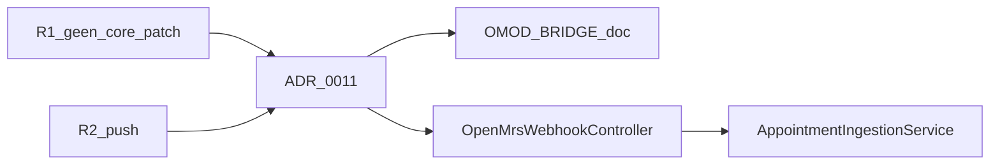

# Requirements traceability

Overzicht: welke requirements zijn behaald, via welk ontwerp (C4/ADR), welke FMEA-maatregel, en hoe we het **weten** (tests, metrics, logs).

## Requirements

| ID | Requirement | Status |
|----|-------------|--------|
| R1 | Integratie met OpenMRS **zonder core-wijzigingen** | Behaald |
| R2 | **Push-based** koppeling (lage latentie voor reminders) | Behaald |
| R3 | **Resiliency** bij storingen (retry, persistentie, geen stille dataverlies) | Behaald |
| R4 | **Privacy** — beperkte bewaartermijn, geen PII in delivery-logs | Behaald |
| R5 | **Multi-tenant** organisaties met eigen API-key en providerbeleid | Behaald |
| R6 | OpenMRS webhook-contract | Behaald |
| R7 | **Observability** — traces, metrics, dashboards | Behaald |
| R8 | Architectuur gedocumenteerd in **C4** gekoppeld aan requirements | Behaald |
| R9 | **FMEA** met mitigaties per component | Behaald |
| R10 | **ADR's** voor belangrijke keuzes | Behaald |

## Traceability matrix

| Req | Design (C4 / ADR) | FMEA | Test / bewijs | Runtime evidence |
|-----|-------------------|------|---------------|------------------|
| R1 | C2: Notification Bridge OMOD container; [ADR 0011](madr/0011-openmrs-omod-bridge.md); [OMOD_BRIDGE.md](openmrs/OMOD_BRIDGE.md) | OMOD-sectie: geen core-patch | T-OMOD-01 (outbox demo) | Module upload in OpenMRS Admin (geen fork) |
| R2 | C1/C2 webhook-pijl; [ADR 0004](madr/0004-integratiemethode.md) | — | `OpenMrsWebhookApiTests` | `appointments_ingested_total` na webhook |
| R3 | [RELIABILITY.md](RELIABILITY.md); OMOD outbox; scheduler revert | Producer down, RMQ down, publish failure | `NotificationSchedulerReadinessTests`, `comprehensive-test.sh`, T-OMOD-01 | Logs: RabbitMQ retry; metric `scheduler_due_notifications_count` |
| R4 | [ADR 0003](madr/0003-technologie-stack-messaging-opslag.md) | Data retention, geen PII in deliveries | `DataRetentionRulesTests`, `DataRetentionPurgeTests` | `DataRetentionWorker`; `notification_deliveries` zonder naam/telefoon |
| R5 | C2 org-scoped API keys | Verkeerde API key | `OrganizationsApiTests`, `AppointmentApiKeyAuthFilter` | `organizations` + `X-Api-Key` per tenant |
| R6 | `OpenMrsWebhookController`; [ADR 0011](madr/0011-openmrs-omod-bridge.md) | Ongeldige payload | `OpenMrsWebhookMapperTests`, `OpenMrsWebhookApiTests` | `POST /api/webhooks/openmrs/...` → 202 |
| R7 | [ADR 0006](madr/0006-observabilty-stack.md), [ADR 0007](madr/0007-opentelemetry-logs-with-loki.md) | — | `comprehensive-test.sh` observability checks | Grafana dashboards; Jaeger; `/health`, `/ready` |
| R8 | [c4/expl.md](c4/expl.md) mermaid + tabellen | — | Review document | C1/C2/C3 diagrammen |
| R9 | [fmea/FMEA.md](fmea/FMEA.md) | Alle secties | [TESTONTWERP_FMEA.md](TESTONTWERP_FMEA.md) | Code-referenties in FMEA |
| R10 | [madr/README.md](madr/README.md) incl. 0011 | — | ADR review | 11 accepted ADRs |

## OpenMRS-specifiek bewijs (R1 + R2)

**Hoe weten we dat R1 behaald is?** De integratie zit in een installeerbare OMOD; Communicatiemodule is een apart proces (.NET). Geen commits in `openmrs-core`.

**Hoe weten we dat R2 behaald is?** OMOD POST direct na appointment-event; geen polling van OpenMRS DB. Bewijs: succesvolle `202` op `POST /api/webhooks/openmrs/appointments/{org}` + `appointments_ingested_total`.

## Nog open / beperkingen

| Item | Impact | Mitigatie |
|------|--------|-----------|
| OMOD Java-artefact niet in deze repo | R1 demo vereist aparte build | Documentatie + contracttests op Producer-kant |
| Telefoon/e-mail niet altijd in basis-payload | Aflevering kan falen | OMOD verrijking; FMEA T-OMOD-04 |
| Outbox-demo handmatig | T-OMOD-01 niet geautomatiseerd in CI | Demo-script in TESTONTWERP_FMEA |

## Zie ook

- [TESTONTWERP_FMEA.md](TESTONTWERP_FMEA.md)
- [TESTRAPPORT.md](TESTRAPPORT.md)
- [TEST_CHECKLIST.md](TEST_CHECKLIST.md)
