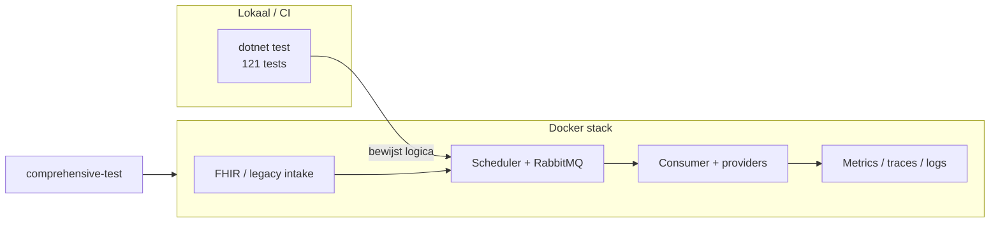

# Testrapportage

**Voor wie:** beoordelaar of teamgenoot die snel wil zien *of* de module betrouwbaar en uitbreidbaar is — zonder het ontwerp opnieuw te lezen.


| Onderdeel                                                    | Status                          | Vertrouwen                           |
| ------------------------------------------------------------ | ------------------------------- | ------------------------------------ |
| Betrouwbaarheid (retry, DLQ, fallback, encryptie, retention) | Sterk in unit-tests + deels E2E | Hoog op codepad; E2E na schone stack |
| Uitbreidbaarheid (providers, tenants, FHIR, rapportage)      | Gedekt in unit/API-tests        | Hoog                                 |
| Volledige stack + observability                              | Script + checklist              | Hoog                                 |


Dieper ontwerp en maatregelen staan elders — hier alleen **bewijs via tests**:

- [RELIABILITY.md](RELIABILITY.md) — retries, DLQ, fallback
- [EXTENSIBILITY.md](EXTENSIBILITY.md) — providers, multi-tenancy, tekenset
- [fmea/FMEA.md](fmea/FMEA.md) — failure modes per component

---

## Hoe we testen (drie lagen)




1. **Unit / integratie** — `dotnet test NotificationModule.sln` in `[tests/NotificationModule.Tests/](../tests/NotificationModule.Tests/)` (Producer, Consumer, Shared, security, observability).
2. **Systeem** — `docker compose` + `[scripts/comprehensive-test.ps1](../scripts/comprehensive-test.ps1)` (Windows) of `[.sh](../scripts/comprehensive-test.sh)`. Volledige matrix: [TEST_CHECKLIST.md](../TEST_CHECKLIST.md).
3. **CI** — GitHub Actions: `dotnet test` + Docker build (`[.github/workflows/ci.yml](../.github/workflows/ci.yml)`).

---

## Wat we zeker weten — betrouwbaarheid

Deze punten sluiten aan op de FMEA (Producer, RabbitMQ, Consumer, PostgreSQL). Per gedrag: wat we controleren, en waar het bewijs staat.

- **Geen notificaties in het verleden; pending blijft opnieuw inplannen** — scheduler en ingestie houden verleden en stale jobs bij. *Tests:* `AppointmentIngestionServiceTests`, `NotificationSchedulerReadinessTests`.
- **RabbitMQ: max. 3 retries, daarna DLQ** — bij deserialize-fouten of permanente fouten belandt het bericht niet eindeloos in de hoofdqueue. *Tests:* `RabbitMqMessageFailurePolicyTests`, `RabbitMqDeadLetterPublisherTests`.
- **Provider-fallback en eindstatus** — bij falen van een provider wordt de keten doorlopen; delivery eindigt als `Sent` of `Failed`. *Tests:* `DeliveryTrackingServiceTests`, `ProviderResponseIdsTests`.
- **Secrets veilig, logs schoon** — AES-256-GCM voor opslag; geen plaintext credentials in logs. *Tests:* `AesGcmSecretProtectorTests`, `ProviderSecretsStoreTests`, `LogRedactionTests`.
- **Data retention** — PII binnen 14 dagen; meta maximaal een jaar. *Tests:* `DataRetentionRulesTests`, `DataRetentionPurgeTests`.
- **Hele ketting onder Docker** — stack healthy, FHIR-intake, dispatch in consumer-logs, metrics/traces. *Script:* `comprehensive-test` (zie [Systeemtest-codes](#systeemtest-codes) hieronder).

---

## Wat we zeker weten — uitbreidbaarheid

- **Nieuwe provider zonder dispatcher aan te passen** — adapter + queue-mapping volstaan. *Tests:* `NotificationQueueMappingTests`, `SwiftSendProviderMessageIdTests`.
- **Per organisatie eigen providerkeuze en fallback** — preferred + fallback chain per tenant. *Tests:* `OrganizationProviderPolicyServiceTests`, `OrganizationsApiTests`.
- **FHIR en UTF-8** — validatie en mapping van afspraakresources. *Tests:* `FhirRequestEncodingTests`, `FhirAppointmentMapperTests`.
- **Toekomstige meldingtypes** — gedocumenteerd pad (o.a. labuitslag in [EXTENSIBILITY.md](EXTENSIBILITY.md)); patroon in `NotificationMessageBuilderTests`.
- **Factuurcontrole zonder PII** — rapportage op meta-niveau. *Tests:* `BillingDeliveriesReportServiceTests`, `ReportsApiTests`.

---

## Systeemtest-codes

Het script labelt checks met korte ID’s (volledige lijst in [TEST_CHECKLIST.md](../TEST_CHECKLIST.md)):


| Prefix           | Betekenis                                                   | Voorbeelden                 |
| ---------------- | ----------------------------------------------------------- | --------------------------- |
| **I**            | Infrastructure — containers en HTTP-probes                  | I1–I6, ComWorld, OTEL       |
| **H**            | Health endpoints — `/health` op services                    | H1–H4                       |
| **E**            | FHIR / JSON API — statuscodes op intake                     | E1, E3, E8, E13, E15, E17   |
| **AUTH**         | Authenticatie — 401 zonder/slechte key, 202 met geldige key | AUTH1–AUTH3, AUTH5          |
| **DB** / **SEC** | Database-seed en security-SQL                               | DB4–DB9, SEC1–SEC3          |
| **MQ**           | Pipeline — queue + consumer dispatch                        | MQ3 (“Sending via” in logs) |
| **M** / **AL**   | Prometheus-metrics en alert rules                           | M1, M9–M12                  |
| **T** / **L**    | Jaeger services, Loki ready                                 | T1, L1                      |


Handmatige follow-ups (chaos, elk ComWorld-provider, Grafana-panelen) staan in de checklist maar zitten niet in het geautomatiseerde script.

---

## Zelf draaien

Typische volgorde (stack eerst, dan tests):

```powershell
# 1. Stack (eerste keer of na schema-wijziging: -v voor schone volumes)
docker compose --env-file env.example up --build -d

# 2. Unit tests — verwacht: Passed: 121, Failed: 0
dotnet test NotificationModule.sln

# 3. Systeemtests (Windows)
.\scripts\comprehensive-test.ps1
```

Linux/macOS/Git Bash: `./scripts/comprehensive-test.sh` in plaats van het PowerShell-script.

Volledige checklist inclusief handmatige stappen: [TEST_CHECKLIST.md](../TEST_CHECKLIST.md).

---

## Resultaten van de laatste run


| Uitvoering           | Datum      | Passed | Failed | Opmerking                                        |
| -------------------- | ---------- | ------ | ------ | ------------------------------------------------ |
| `dotnet test`        | 2026-05-25 | 121    | 0      | Lokaal (`Release`)                               |
| `comprehensive-test` | 2026-05-25 | 18     | 2      | Zie [Bekende issue](#bekende-issue-bij-deze-run) |
| CI (GitHub Actions)  | —          | —      | —      | `dotnet test` + Docker build bij elke PR/push    |


Voorbeeld `dotnet test`-uitvoer

```
Passed!  - Failed: 0, Passed: 121, Skipped: 0, Total: 121
```


### Bekende issue bij deze run

**Symptoom:** AUTH3 en AUTH5 gaven geen 202 na geldige org-key.

**Oorzaak:** Bestaand Postgres-volume miste kolom `PiiPurgedAt`. Entity Framework dacht dat migraties al waren toegepast; de database-schema’s liepen achter op de code.

**Oplossing:** Volume legen en stack opnieuw opbouwen:

```powershell
docker compose down -v
docker compose --env-file env.example up --build -d
.\scripts\comprehensive-test.ps1
```

**Interpretatie:** Geen regressie in auth-logica; omgevings-/migratie-drift. Voor inlevering of demo: altijd eerst schone volumes of expliciete migratie-run.

---

## Conclusie

We zijn **overtuigd van de kern** op basis van 121 geautomatiseerde unit/integratietests: scheduler-gedrag, message-broker policies, provider-fallback, encryptie en retention zijn expliciet afgedekt. **Uitbreidbaarheid** volgt uit `INotificationProvider`, queue-mapping per kanaal, multi-tenant beleid en een gedocumenteerd pad voor nieuwe meldingtypes — elk met gerichte tests.

Het **systeemscript** bevestigt de volledige Docker-keten (intake → queue → consumer → metrics/traces). De laatste run was bijna volledig groen; de twee failures zijn verklaard en oplosbaar met een schone database. **Voor een definitieve “alles groen”-claim:** `docker compose down -v`, comprehensive-test opnieuw, en CI op `main` controleren.

---

## Bijlage — traceabilitytabel

Voor koppeling aan opdracht/FMEA zonder de leestekst hierboven te herhalen.

### Betrouwbaarheid


| Scenario (FMEA)                       | Tests / script                                                                 |
| ------------------------------------- | ------------------------------------------------------------------------------ |
| Scheduler retry & stale recovery      | `AppointmentIngestionServiceTests`, `NotificationSchedulerReadinessTests`      |
| RabbitMQ retry & DLQ                  | `RabbitMqMessageFailurePolicyTests`, `RabbitMqDeadLetterPublisherTests`        |
| Provider fallback & delivery tracking | `DeliveryTrackingServiceTests`, `ProviderResponseIdsTests`                     |
| Secrets & encryptie                   | `AesGcmSecretProtectorTests`, `ProviderSecretsStoreTests`, `LogRedactionTests` |
| Data retention                        | `DataRetentionRulesTests`, `DataRetentionPurgeTests`                           |
| End-to-end pipeline                   | `comprehensive-test` (I*, H*, E*, MQ3, M*, T1, L1)                             |


### Uitbreidbaarheid


| Scenario                       | Tests                                                                                |
| ------------------------------ | ------------------------------------------------------------------------------------ |
| Vier providers + queue-mapping | `NotificationQueueMappingTests`, `SwiftSendProviderMessageIdTests`                   |
| Multi-tenant providerbeleid    | `OrganizationProviderPolicyServiceTests`, `OrganizationsApiTests`                    |
| Tekenset / FHIR                | `FhirRequestEncodingTests`, `FhirAppointmentMapperTests`                             |
| Nieuwe meldingtypes (ontwerp)  | [EXTENSIBILITY.md](EXTENSIBILITY.md) § labuitslag; `NotificationMessageBuilderTests` |
| Billing / rapportage           | `BillingDeliveriesReportServiceTests`, `ReportsApiTests`                             |


