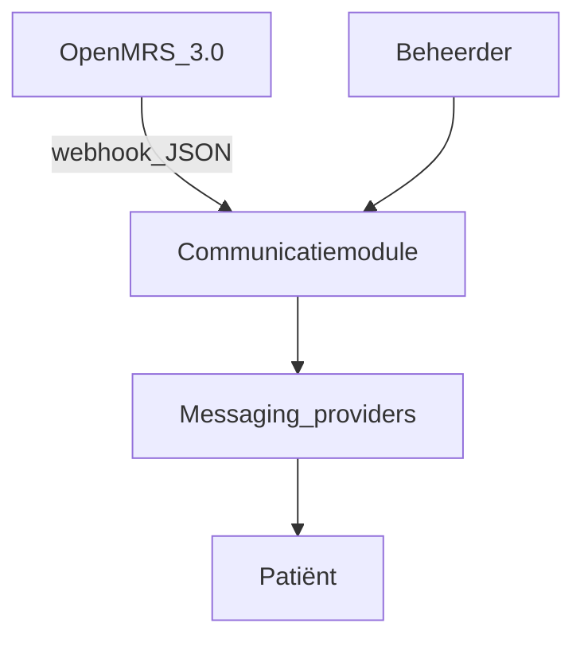
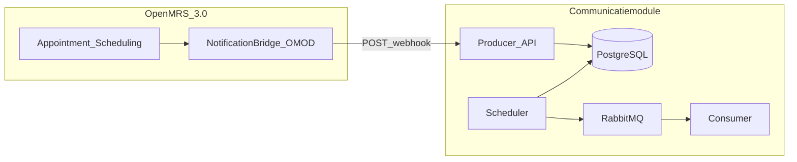

# C4 Model — Communicatiemodule

Koppeling met requirements: [REQUIREMENTS_TRACEABILITY.md](../REQUIREMENTS_TRACEABILITY.md) · OpenMRS-bridge: [OMOD_BRIDGE.md](../openmrs/OMOD_BRIDGE.md)

---

## C1 Context diagram

Toont het systeem op het hoogste niveau: wie gebruikt het en met welke externe systemen communiceert het.

**Actoren:** Patiënt (ontvangt notificaties), Beheerder (monitort dashboard), OpenMRS organisatie (levert afspraken aan via OMOD-bridge).

**Externe systemen:** OpenMRS 3.0 (met Notification Bridge OMOD), SwiftSend, LegacyLink, AsyncFlow en SecurePost.

---

## C2 Container diagram

Toont de deploybare onderdelen van het systeem en hoe ze communiceren.

| Container | Verantwoordelijkheid |
| --------- | -------------------- |
| **OpenMRS 3.0 + Notification Bridge OMOD** | Vangt appointment-events op; outbox + HTTP POST naar Communicatiemodule (geen core-wijzigingen) |
| Producer API | Ontvangt OpenMRS-webhooks (`/api/webhooks/openmrs/...`) en plant notificaties in de database |
| Scheduler | Pollt de database en publiceert berichten naar RabbitMQ op het juiste moment |
| Message Broker (RabbitMQ) | Verdeelt berichten via fanout exchange naar provider-queues |
| Consumer | Leest queues uit, verstuurt naar providers en logt het resultaat |
| Database (PostgreSQL) | Slaat afspraken, notificaties, delivery-logs en versleutelde secrets op |

**Requirement-koppeling:** R1 (geen OpenMRS core-patch) → OMOD-container; R2 (push) → webhook-pijl; R3 (resiliency) → outbox in OMOD + retries in Producer/Consumer.

---

## C3 Component diagram

Toont de belangrijkste **code-componenten** binnen de Producer- en Consumer-containers (C4 Level 3). De scheduler draait in hetzelfde Producer-proces als de REST API; C2 toont ze soms apart voor leesbaarheid.

| Component | Container | Verantwoordelijkheid |
| --------- | --------- | -------------------- |
| `OpenMrsWebhookController` | Producer | Ontvangt OMOD JSON-webhook, mapt naar intern model |
| `OpenMrsWebhookMapper` | Producer | Vertaalt `event`/`status`/velden naar `AppointmentMessage` |
| `AppointmentIngestionService` | Producer | Upsert `appointments`, plant of annuleert `scheduled_notifications` |
| `NotificationSchedulerWorker` | Producer | Pollt due rijen, claimt `Pending → Publishing`, roept publisher aan |
| `RabbitMqPublisher` | Producer | Serialiseert `AppointmentMessage` en publiceert naar RabbitMQ exchange |
| `NotificationWorker` | Consumer | Consumeert provider-queues, deserialiseert berichten, orkestreert dispatch |
| `NotificationDispatcher` | Consumer | Roept de juiste provider-adapter aan op basis van queue/routing key |
| `SwiftSendProvider` | Consumer | JSON REST naar SwiftSend (FakeComWorld) |
| `LegacyLinkProvider` | Consumer | XML/SOAP naar LegacyLink |
| `SecurePostProvider` | Consumer | OAuth + JSON naar SecurePost |
| `AsyncFlowProvider` | Consumer | Async JSON workflow naar AsyncFlow |
| `ProviderSecretsStore` | Consumer | Haalt en decrypt provider credentials uit `provider_secrets` |
| `DeliveryTrackingService` | Consumer | Schrijft `notification_deliveries` en `billing_delivery_events`, zet eindstatus |

Bronbestanden: `src/NotificationModule.Producer/` en `src/NotificationModule.Consumer/`.

---

## Process flow (end-to-end)

Volledige keten van afspraak-intake tot delivery-log, inclusief alternatieve paden bij annulering of wijziging.

### Happy path (OpenMRS OMOD — primair)

1. **OpenMRS** — appointment create/update → Notification Bridge OMOD
2. **OMOD** — outbox + POST JSON naar `OpenMrsWebhookController`
3. **OpenMrsWebhookMapper** — map naar `AppointmentMessage`
4. **AppointmentIngestionService** — upsert `appointments`, create `scheduled_notifications` (`Pending`)
5. **PostgreSQL** — persist
6. **NotificationSchedulerWorker** — claim due rows (`Pending → Publishing → Queued`)
7. **RabbitMqPublisher → RabbitMQ** — publish `AppointmentMessage`
8. **NotificationWorker** — consume from provider queue
9. **NotificationDispatcher + provider adapter** — HTTP naar messaging provider
10. **DeliveryTrackingService** — write `notification_deliveries` + `billing_delivery_events`

Bij provider-fout: **fallback republish** naar de volgende provider in de organisatieketen (zie [`RELIABILITY.md`](../RELIABILITY.md)).

### Alternatieve paden (vanaf stap 4)

| Trigger | Gedrag |
| ------- | ------ |
| **Cancel** (`status = cancelled`) | Alle `Pending` `scheduled_notifications` → `Cancelled`; geen nieuwe reminders |
| **Update** (nieuwe starttijd of gegevens) | Oude `Pending` rijen annuleren, nieuwe reminders herberekenen (`RebuildPendingNotificationsAsync`) |

Implementatie: [`AppointmentIngestionService.cs`](../../src/NotificationModule.Producer/Services/AppointmentIngestionService.cs).
