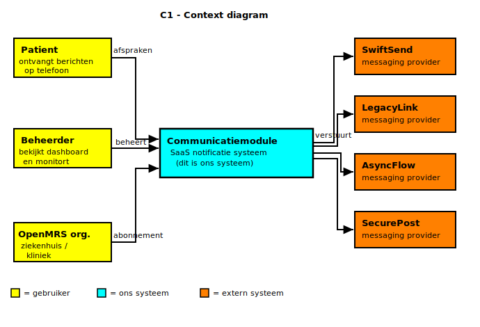
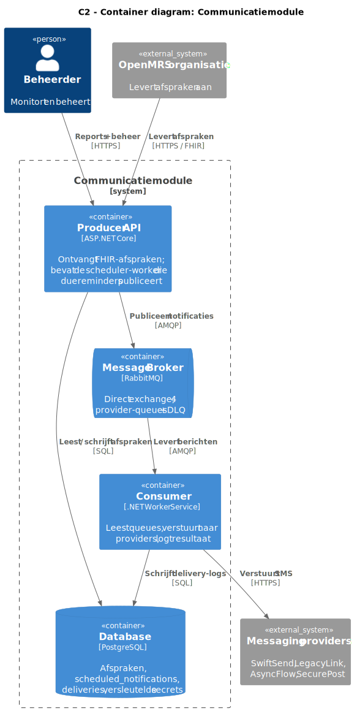
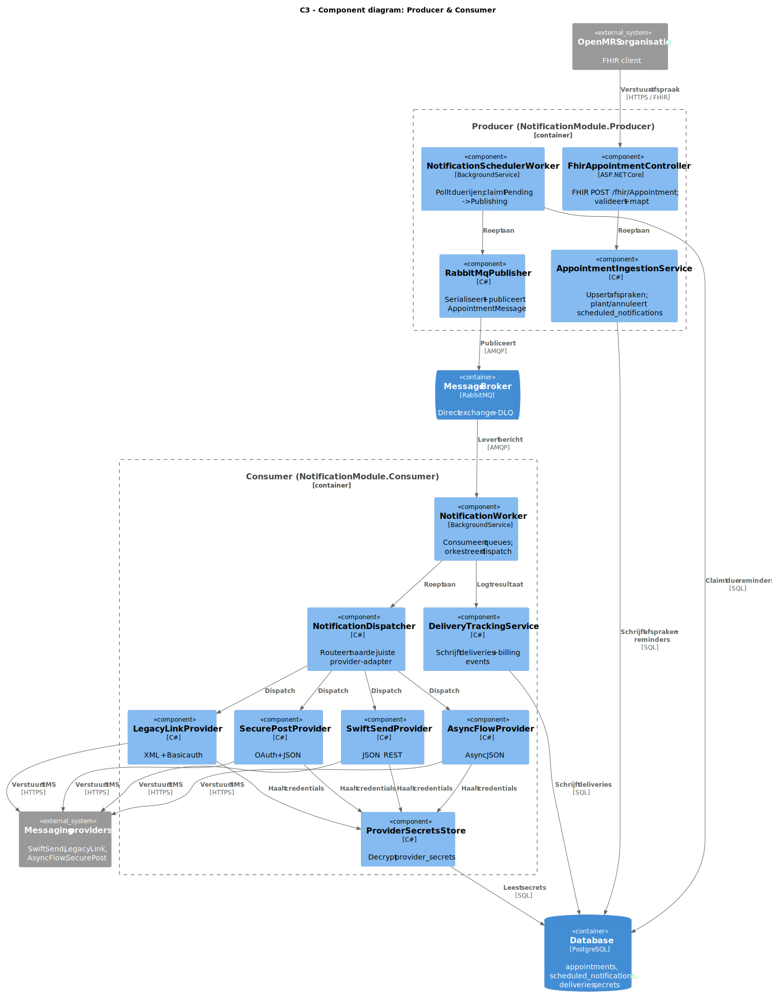
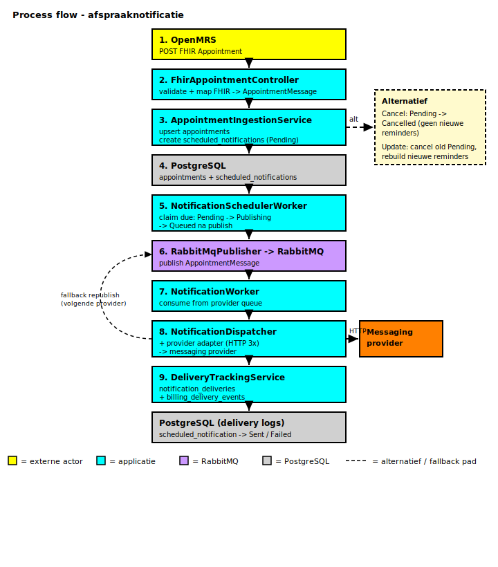

# C4 Model  Communicatiemodule

---

## C1 Context diagram

Toont het systeem op het hoogste niveau: wie gebruikt het en met welke externe systemen communiceert het.

**Actoren:** Patiënt (ontvangt notificaties), Beheerder (monitort dashboard), OpenMRS organisatie (levert afspraken aan).

**Externe systemen:** SwiftSend, LegacyLink, AsyncFlow en SecurePost — de messaging providers die berichten afleveren.

---

## C2 Container diagram

Toont de deploybare onderdelen van het systeem en hoe ze communiceren.

| Container                 | Verantwoordelijkheid                                                         |
| ------------------------- | ---------------------------------------------------------------------------- |
| Producer API              | Ontvangt afspraken via REST en plant notificaties in de database             |
| Scheduler                 | Pollt de database en publiceert berichten naar RabbitMQ op het juiste moment |
| Message Broker (RabbitMQ) | Verdeelt berichten via fanout exchange naar vier provider-queues             |
| Consumer                  | Leest queues uit, verstuurt naar providers en logt het resultaat             |
| Database (PostgreSQL)     | Slaat afspraken, notificaties, delivery-logs en versleutelde secrets op      |

---

## C3 Component diagram

Toont de belangrijkste **code-componenten** binnen de Producer- en Consumer-containers (C4 Level 3). De scheduler draait in hetzelfde Producer-proces als de REST API; C2 toont ze soms apart voor leesbaarheid.

| Component | Container | Verantwoordelijkheid |
| --------- | --------- | -------------------- |
| `FhirAppointmentController` | Producer | Ontvangt FHIR `Appointment` POST, valideert encoding en payload, mapt naar intern model |
| `AppointmentIngestionService` | Producer | Upsert `appointments`, plant of annuleert `scheduled_notifications` |
| `NotificationSchedulerWorker` | Producer | Pollt due rijen, claimt `Pending → Publishing`, roept publisher aan |
| `RabbitMqPublisher` | Producer | Serialiseert `AppointmentMessage` en publiceert naar RabbitMQ exchange |
| `NotificationWorker` | Consumer | Consumeert provider-queues, deserialiseert berichten, orkestreert dispatch |
| `NotificationDispatcher` | Consumer | Roept de juiste provider-adapter aan op basis van queue/routing key |
| `SwiftSendProvider` | Consumer | JSON REST naar SwiftSend (FakeComWorld) |
| `LegacyLinkProvider` | Consumer | XML/SOAP naar LegacyLink |
| `SecurePostProvider` | Consumer | OAuth + JSON naar SecurePost |
| `AsyncFlowProvider` | Consumer | Async JSON workflow naar AsyncFlow |
| `ProviderSecretsStore` | Consumer | Haalt en decrypt provider credentials uit `provider_secrets` |
| `DeliveryTrackingService` | Consumer | Schrijft `notification_deliveries` en `billing_delivery_events`, zet eindstatus |

Bronbestanden: `src/NotificationModule.Producer/` en `src/NotificationModule.Consumer/`.

---

## Process flow (end-to-end)

Volledige keten van afspraak-intake tot delivery-log, inclusief alternatieve paden bij annulering of wijziging.

### Happy path

1. **OpenMRS** — POST FHIR `Appointment`
2. **FhirAppointmentController** — validate + map
3. **AppointmentIngestionService** — upsert `appointments`, create `scheduled_notifications` (`Pending`)
4. **PostgreSQL** — persist
5. **NotificationSchedulerWorker** — claim due rows (`Pending → Publishing → Queued`)
6. **RabbitMqPublisher → RabbitMQ** — publish `AppointmentMessage`
7. **NotificationWorker** — consume from provider queue
8. **NotificationDispatcher + provider adapter** — HTTP naar messaging provider (max 3 pogingen)
9. **DeliveryTrackingService** — write `notification_deliveries` + `billing_delivery_events`

Bij provider-fout: **fallback republish** naar de volgende provider in de organisatieketen (zie [`RELIABILITY.md`](../RELIABILITY.md)).

### Alternatieve paden (vanaf stap 3)

| Trigger | Gedrag |
| ------- | ------ |
| **Cancel** (`status = cancelled`) | Alle `Pending` `scheduled_notifications` → `Cancelled`; geen nieuwe reminders |
| **Update** (nieuwe starttijd of gegevens) | Oude `Pending` rijen annuleren, nieuwe reminders herberekenen (`RebuildPendingNotificationsAsync`) |

Implementatie: [`AppointmentIngestionService.cs`](../../src/NotificationModule.Producer/Services/AppointmentIngestionService.cs).
