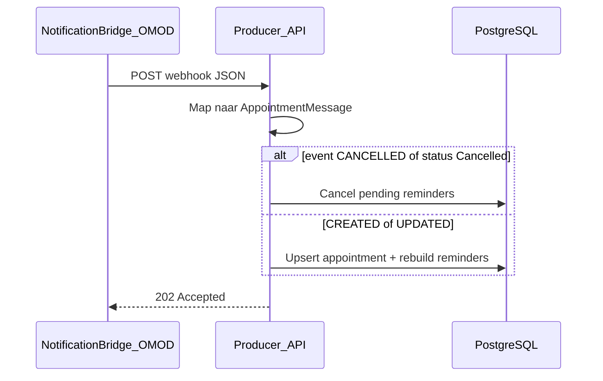

# OpenMRS 3.0 — integratiepunten voor de Notification Bridge OMOD

Dit document beschrijft waar in OpenMRS 3.0 (Platform + Appointment Scheduling) de bridge-OMOD kan inhaken **zonder wijzigingen aan OpenMRS core**.

## Doel

Bij **create**, **update** en **cancel** van een afspraak moet de OMOD een webhook naar de Communicatiemodule sturen. De payload is het [OMOD-contract](OMOD_BRIDGE.md#webhook-payload).

## Aanbevolen hook-punten (OpenMRS 3.0)

| Gebeurtenis | Bron in OpenMRS | Aanbevolen integratie | `event`-waarde |
|-------------|-----------------|----------------------|----------------|
| Nieuwe afspraak | Appointment Scheduling module — `AppointmentService.saveAppointment()` / REST create | `Advice` na commit of module-specifieke event listener | `CREATED` |
| Wijziging | `AppointmentService.saveAppointment()` bij bestaande UUID | Zelfde listener; onderscheid via bestaand record | `UPDATED` |
| Annulering | Statuswijziging naar `Cancelled` of dedicated cancel-flow | Listener op status + cancel API | `CANCELLED` |

### Waarom geen core-patches

- **Advice** (`org.springframework.aop`) rond de Appointment Scheduling service: intercepteert alle mutaties via de officiële API-laag.
- **ModuleApplicationListener** / Spring `@EventListener`: luistert naar module-events als Appointment Scheduling die publiceert.
- **Geen** wijzigingen in `openmrs-core` of fork van de platform-distributie.

## Idempotency

| Veld | Gebruik |
|------|---------|
| `appointmentUuid` | Primaire sleutel; correspondeert met `(organization_id, appointment_uuid)` in de Communicatiemodule |
| `event` + `status` | Bepaalt of pending reminders worden aangemaakt, herbouwd of geannuleerd |
| `startDateTime` | Herberekening van reminder-tijden bij `UPDATED` |

De Communicatiemodule doet een **upsert** op `appointmentUuid`; dubbele `CREATED`-events leiden niet tot dubbele reminders zolang de UUID stabiel blijft.

## Velden uit OpenMRS → webhook

| Webhook-veld | OpenMRS-bron (indicatief) |
|--------------|---------------------------|
| `appointmentUuid` | `Appointment.getUuid()` |
| `status` | `Appointment.getStatus()` (bijv. `Scheduled`, `Cancelled`) |
| `startDateTime` / `endDateTime` | `Appointment.getStartDate()` / `getEndDate()` |
| `patientUuid` | `Patient` gekoppeld aan afspraak |
| `patientName` | `PersonName` display |
| `service` | Appointment type / service type |
| `location` | Locatie of afdeling |
| `comments` | Opmerkingen / instructions op de afspraak |

Optioneel (aanbevolen voor aflevering): `patientPhone`, `patientEmail` — ophalen via Patient- of ContactPoint-API in de OMOD vóór POST.

## Event → Producer-gedrag

## Zie ook

- [OMOD_BRIDGE.md](OMOD_BRIDGE.md) — module-ontwerp, outbox, retry
- [../madr/0011-openmrs-omod-bridge.md](../madr/0011-openmrs-omod-bridge.md) — ADR
- [../REQUIREMENTS_TRACEABILITY.md](../REQUIREMENTS_TRACEABILITY.md) — requirement-bewijs
