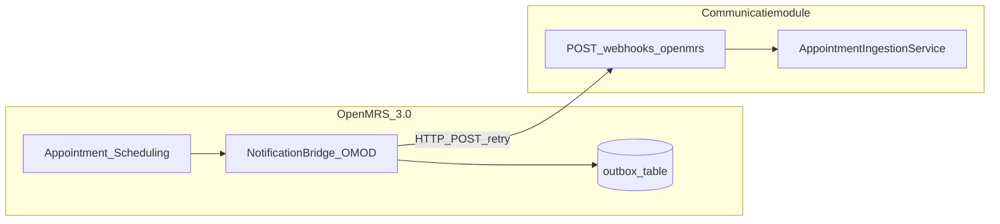

# Notification Bridge OMOD — ontwerp

Eigen OpenMRS-module (`notification-bridge`) die afspraak-events **push** naar de Communicatiemodule. Geen wijzigingen aan OpenMRS core; alleen een installeerbare OMOD bovenop Appointment Scheduling (+ optioneel FHIR2 voor verrijking).

## Architectuur



## Webhook-payload

Contract tussen OMOD en Producer (`POST /api/webhooks/openmrs/appointments/{organizationKey}`):

```json
{
  "event": "CREATED",
  "appointmentUuid": "550e8400-e29b-41d4-a716-446655440000",
  "status": "Scheduled",
  "startDateTime": "2026-06-24T09:00:00Z",
  "endDateTime": "2026-06-24T09:30:00Z",
  "patientUuid": "6b5b5b5b-5b5b-5b5b-5b5b-5b5b5b5b5b5b",
  "patientName": "John Doe",
  "patientPhone": "+31612345678",
  "patientEmail": "john@example.com",
  "service": "General Medicine",
  "location": "Outpatient",
  "comments": "Bring ID"
}
```

| Veld | Verplicht | Toelichting |
|------|-----------|-------------|
| `event` | ja | `CREATED`, `UPDATED`, `CANCELLED` |
| `appointmentUuid` | ja | Stabiele OpenMRS UUID |
| `status` | ja | OpenMRS status; bij `CANCELLED` event wordt status genegeerd ten gunste van cancel-logica |
| `startDateTime` | ja | ISO-8601 UTC |
| `endDateTime` | nee | Alleen voor audit/raw payload |
| `patientUuid`, `patientName` | ja | Voor berichtinhoud |
| `patientPhone`, `patientEmail` | nee | Aanbevolen; zonder contactgegevens faalt provider-aflevering |
| `service`, `location`, `comments` | nee | `comments` → `instructions` in de module |

## Module-configuratie (Global Properties)

| Property | Voorbeeld | Doel |
|----------|-----------|------|
| `notification.bridge.producerUrl` | `https://notifications.example.com` | Basis-URL Communicatiemodule |
| `notification.bridge.organizationKey` | `demo-hospital` | Pad-segment `{organizationKey}` |
| `notification.bridge.apiKey` | *(secret)* | Header `X-Api-Key` |
| `notification.bridge.retryMaxAttempts` | `5` | HTTP retries |
| `notification.bridge.retryDelaySeconds` | `30` | Backoff tussen pogingen |
| `notification.bridge.outboxEnabled` | `true` | Persistente outbox bij Producer-down |

## Outbox (resiliency)

1. Bij elk appointment-event: rij in `notification_bridge_outbox` (status `PENDING`).
2. Background job POST naar Producer; bij `2xx` → `DELIVERED`.
3. Bij timeout/5xx: `PENDING` + `next_attempt_at` met exponential backoff.
4. Bij herstart OpenMRS: job hervat onafgewerkte rijen.

Dit voorkomt verlies van events wanneer de Communicatiemodule tijdelijk niet bereikbaar is (FMEA: Producer down).

## HTTP-client gedrag

- Timeout: 10s connect, 30s read
- Retry: configureerbaar; alleen op 5xx en netwerkfouten (niet op 400)
- Logging: appointment UUID + HTTP-status (geen PII in logs)
- Idempotent op Producer-kant: zelfde UUID opnieuw POSTen is veilig

## Producer-endpoint (reeds geïmplementeerd)

```http
POST /api/webhooks/openmrs/appointments/{organizationKey}
X-Api-Key: <key>
Content-Type: application/json
```

Antwoord: `202 Accepted` met aantal geplande reminders (zelfde semantiek als legacy `/api/appointments`).

Mapping: `OpenMrsWebhookMapper` → `AppointmentMessage` → `AppointmentIngestionService`.

## Build & installatie (indicatief)

1. Maven-module `openmrs-module-notification-bridge` (Java 17, OpenMRS Platform 3.0 SDK).
2. `mvn clean package` → `notificationbridge.omod`.
3. OpenMRS Admin → Manage Modules → upload OMOD.
4. Configureer global properties; maak testafspraak in O3 Appointment UI.

## Zie ook

- [INTEGRATION_POINTS.md](INTEGRATION_POINTS.md)
- [../FHIR_ENDPOINT.md](../FHIR_ENDPOINT.md) — alternatief intake-pad (FHIR clients)
- [../fmea/FMEA.md](../fmea/FMEA.md) — failure modes bridge + Producer
